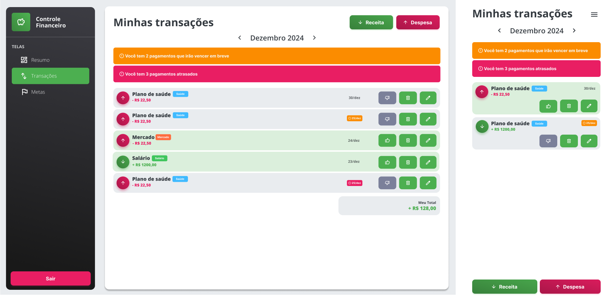
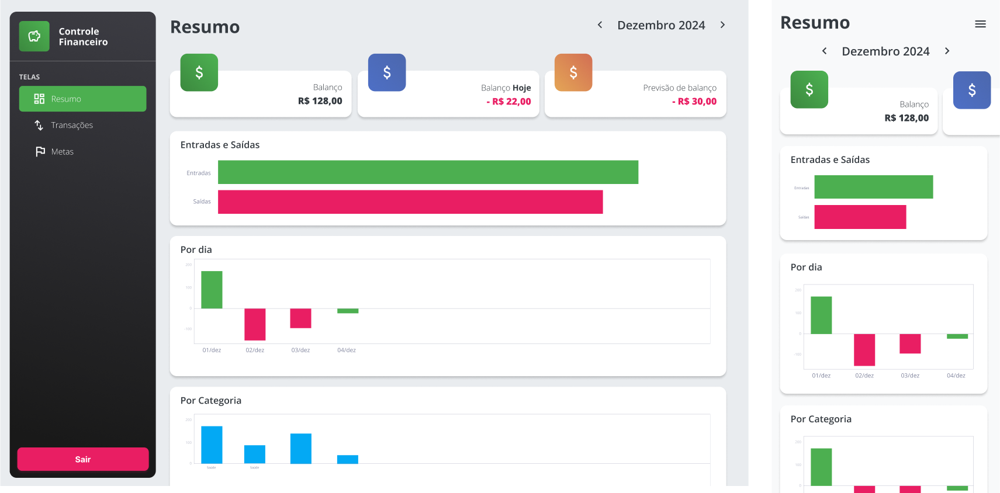
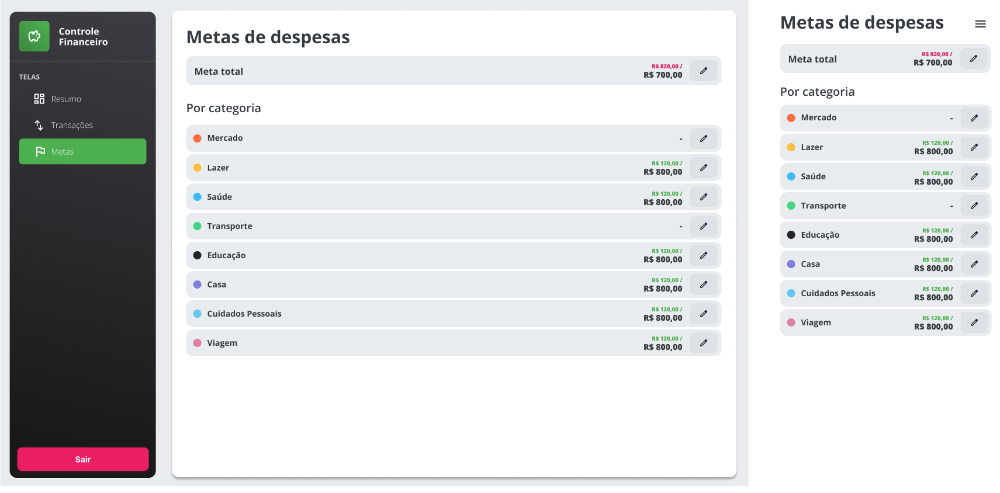
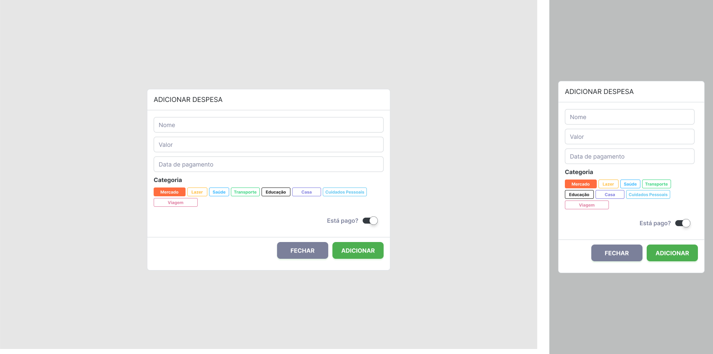
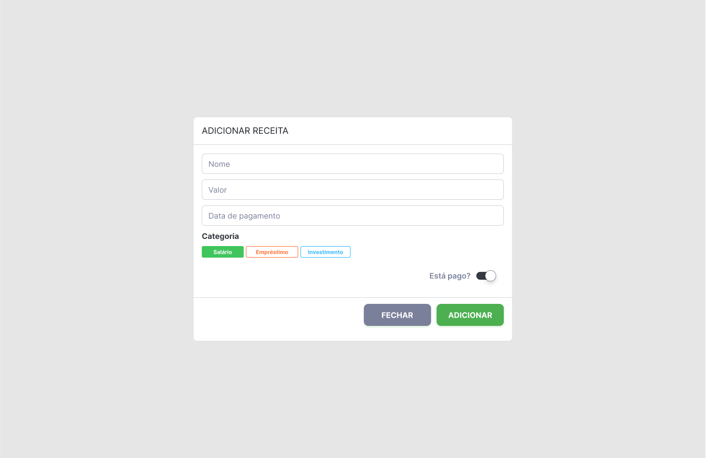
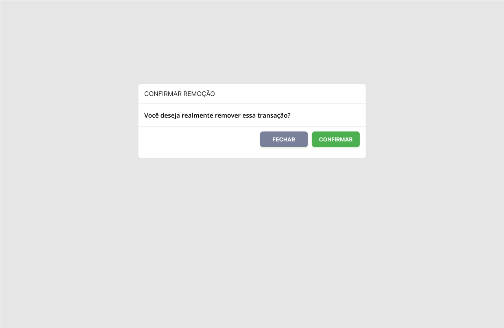
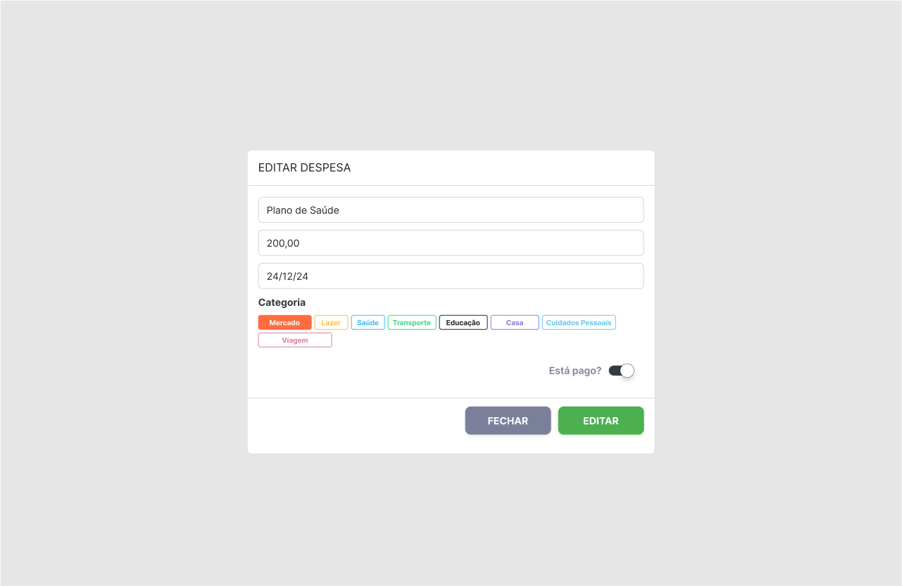
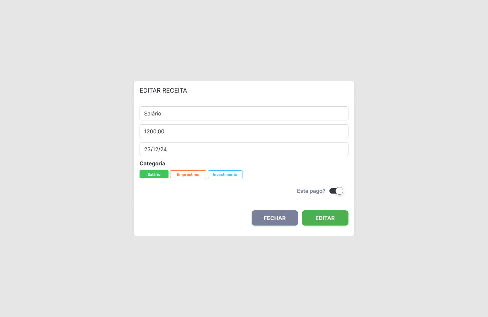
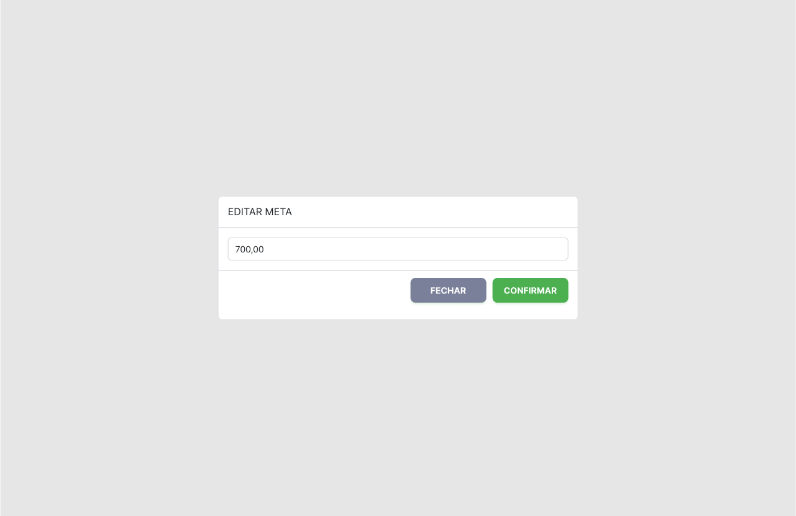

# Projeto de Interface

As telas foram desenvolvidas no Figma. O design focou em criar uma experiência completa para o usuário final, com uma interface responsiva e intuitiva. Além disso, para ajudar na visualização, foi destacado as transações pagas das não pagas, além de destacar as transações que estão vencidas ou próximas de vencer, ajudando assim a ter uma visibilidade maior sobre as contas.

Ademais, foi desenvolvido uma tela para organizar todas as informações relevantes para o usuário como gastos por categoria ou gastos por dia, podendo assim ter um panorama claro de como o dinheiro está sendo gasto.

Por fim, foi também desenvolvido uma tela de metas, onde o usuário pode definir sua meta total ou ainda metas específicas por categoria, favorecendo um maior controle sobre suas finanças.

## User Flow

O usuário começa pela tela de transações

## Wireframes
Tela de transações

Tela de resumo

Tela de metas

Modal Adicionar Despesa

Modal Adicionar Receita

Modal Confirmar remoção

Modal Editar Despesa

Modal Editar Receita

Modal Editar Meta

