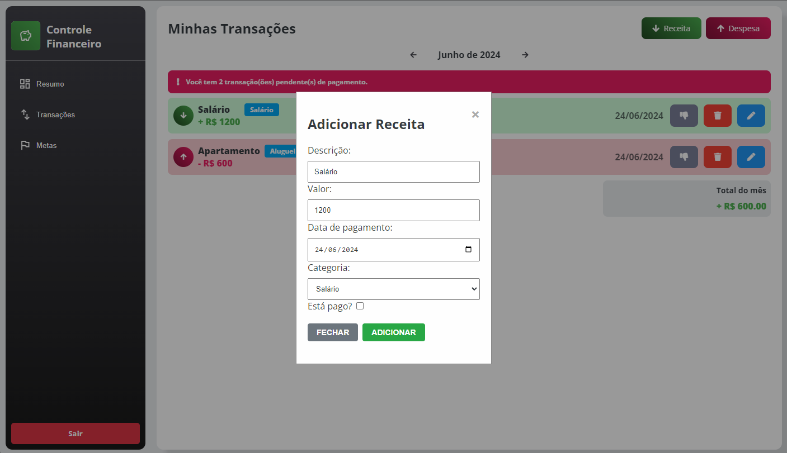
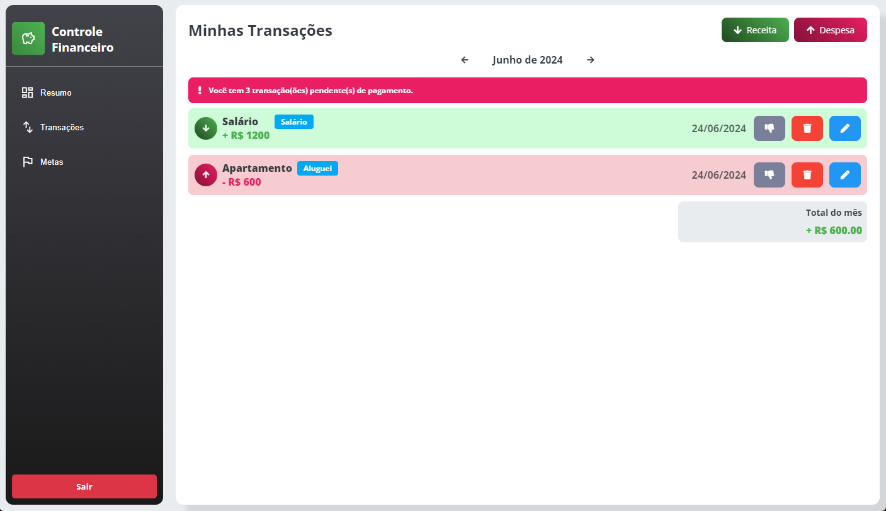
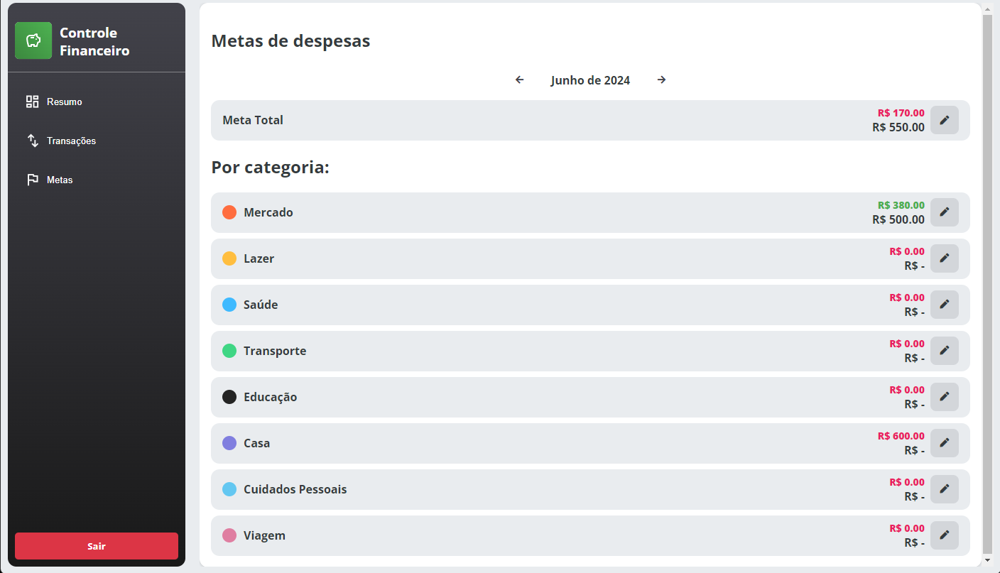
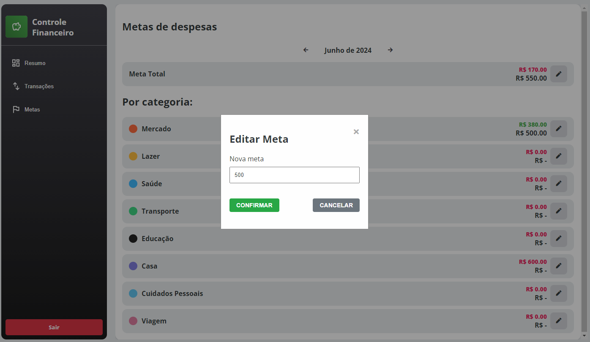
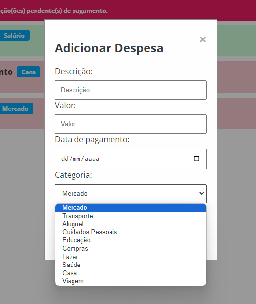
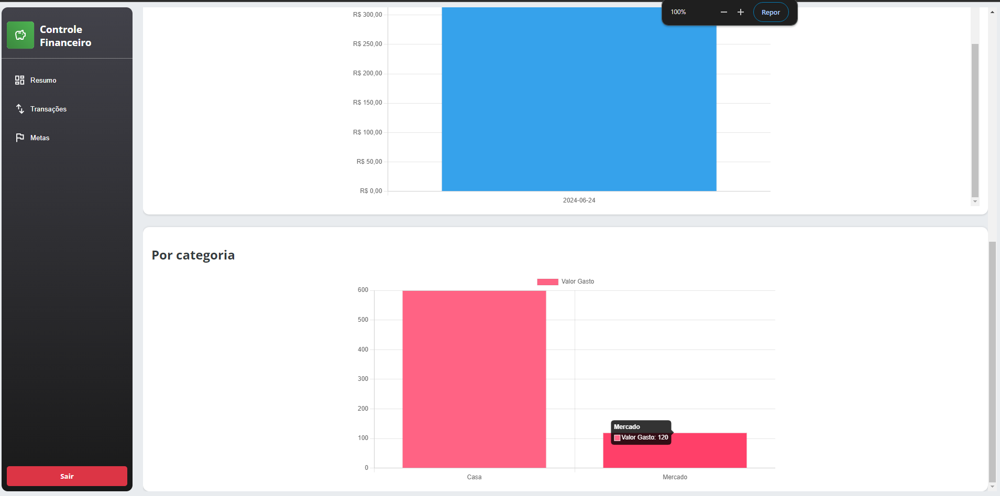

# Registro de Testes de Software

## Teste 1

Permitir que o usuário faça os lançamentos de receitas e despesas;

## Teste 2

Garantir que o usuário possa visualizar o saldo resultante de suas operações de forma clara e acessível.

## Teste 3

Implementar um sistema que permita ao usuário estabelecer e acompanhar metas de gastos, auxiliando na gestão financeira
pessoal;

## Teste 4

Permitir que o usuário utilize categorias pré-estabelecidas para classificar suas transações;

## Teste 5

Incluir gráficos para que o usuário possa visualizar de forma mais clara suas receitas e despesas ao longo do mês;

## Avaliação

Os testes ocorreram em sua majoritariamente de forma bem sucessida, os testes ajudaram a localizar alguns pontos de
melhoria durante o teste, como não mostrar balanço quando não há nenhuma transação, e alguns problemas de layout que
foram corrigidos.
