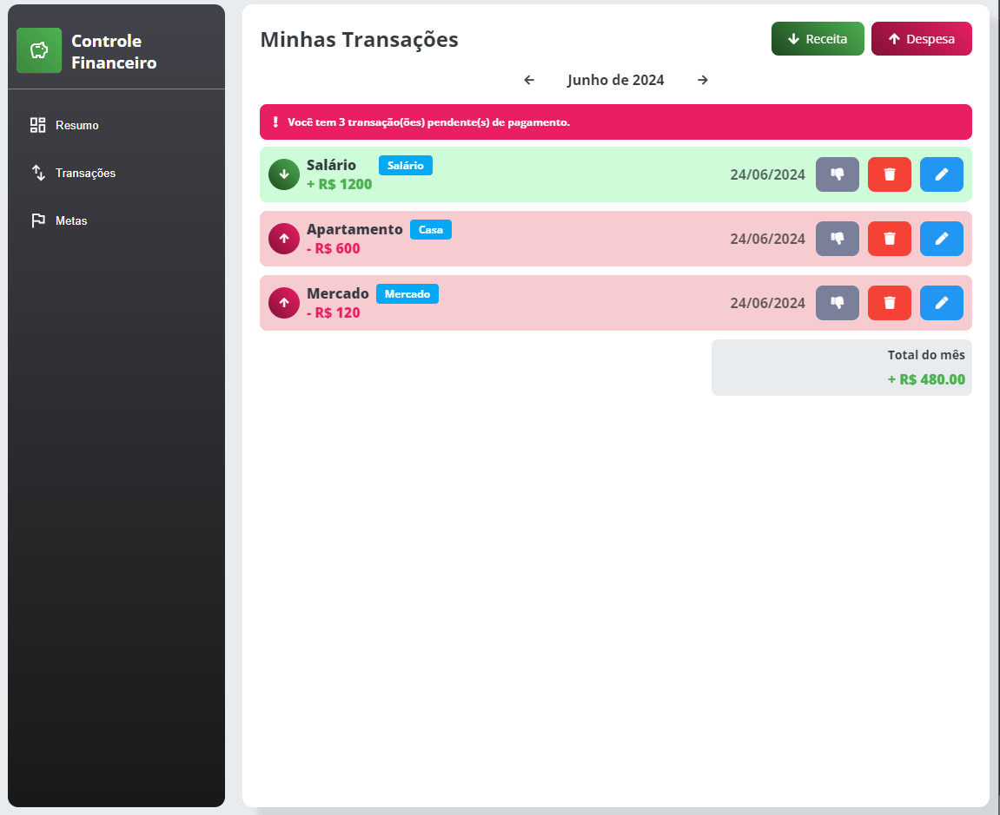
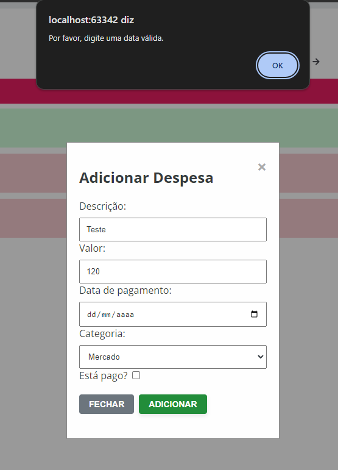
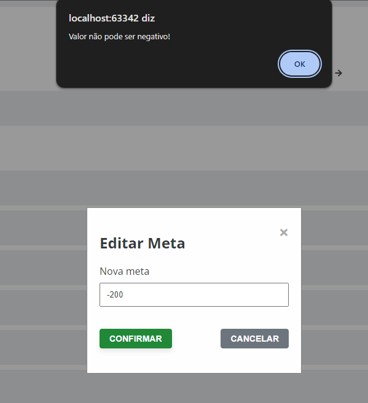
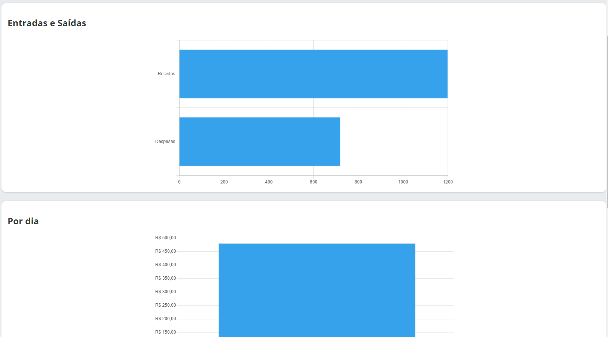

# Registro de Testes de Software

## 1. O sistema deve ser responsivo

## 2. O sistema deve alertar sobre valores inválidos

## 3. O sistema deve possuir formas de mostrar as transações de forma mais concisa

Foi usado gráficos para ter uma melhor visualização das transações.

## 4. O sistema deve usar das cores para destacar informações importantes

Foi utilizado uma cor bem destacada e chamativas para alertas importantes como o de transações atrasadas.

## 5. O sistema deve prevenir operações acidentais

Foi implementado um sistema de confirmação para a remoção de transações, prevenindo que cliques acidentais removam
transações importantes.
